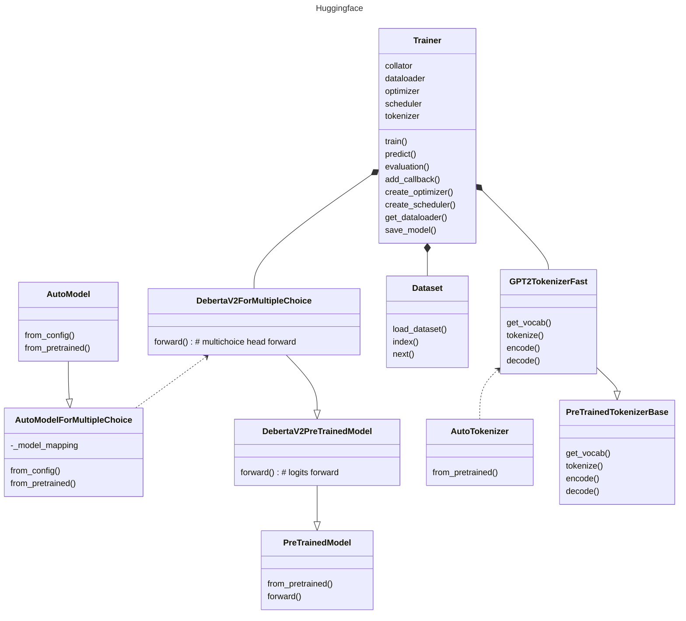

```mermaid
---
title: Huggingface
---
classDiagram
    AutoModel --|> AutoModelForMultipleChoice
    DebertaV2ForMultipleChoice --|> DebertaV2PreTrainedModel
    DebertaV2PreTrainedModel --|> PreTrainedModel
    DebertaV2ForMultipleChoice <.. AutoModelForMultipleChoice 
    Trainer *-- Dataset
    Trainer *-- GPT2TokenizerFast
    GPT2TokenizerFast <.. AutoTokenizer 
    GPT2TokenizerFast --|> PreTrainedTokenizerBase
    Trainer *-- DebertaV2ForMultipleChoice


    
    class Dataset {
        load_dataset()
        index()
        next()
    }

    class AutoTokenizer{
        from_pretrained()
    }

    class PreTrainedTokenizerBase {
        get_vocab()
        tokenize()
        encode()
        decode()
    }
    class GPT2TokenizerFast {
        get_vocab()
        tokenize()
        encode()
        decode()
    }


    class AutoModel {
        from_config()
        from_pretrained()
    }
    class AutoModelForMultipleChoice {
        -_model_mapping 
        from_config()
        from_pretrained()

    }
    class DebertaV2ForMultipleChoice {
        forward() # multichoice head forward
    }
    class DebertaV2PreTrainedModel {
        forward() # logits forward
    }
    class PreTrainedModel {
        from_pretrained()
        forward()
    }
    class Trainer {
        collator
        dataloader 
        optimizer 
        scheduler 
        tokenizer
        train()
        predict()
        evaluation()
        add_callback()
        create_optimizer()
        create_scheduler()
        get_dataloader()
        save_model()
    }


    click Dataset href "https://github.com/huggingface/datasets/blob/ef17d9fd6c648bb41d43ba301c3de4d7b6f833d8/src/datasets/load.py#L1850"
    click AutoTokenizer href "https://github.com/huggingface/transformers/blob/a6e6b1c622d8d08e2510a82cb6266d7b654f1cbf/src/transformers/models/auto/tokenization_auto.py#L533"
    click GPT2TokenizerFast href "https://github.com/huggingface/transformers/blob/main/src/transformers/models/gpt2/tokenization_gpt2_fast.py#L70C7-L70C24"
    click PreTrainedTokenizerBase href "https://github.com/huggingface/transformers/blob/a6e6b1c622d8d08e2510a82cb6266d7b654f1cbf/src/transformers/tokenization_utils_base.py"
    click AutoModel href "https://github.com/huggingface/transformers/blob/a6e6b1c622d8d08e2510a82cb6266d7b654f1cbf/src/transformers/models/auto/modeling_auto.py#L1170"
    click AutoModelForMultipleChoice href "https://github.com/huggingface/transformers/blob/a6e6b1c622d8d08e2510a82cb6266d7b654f1cbf/src/transformers/models/auto/modeling_auto.py#L1271"
    click DebertaV2PreTrainedModel href "https://github.com/huggingface/transformers/blob/a6e6b1c622d8d08e2510a82cb6266d7b654f1cbf/src/transformers/models/deberta_v2/modeling_deberta_v2.py#L1554"
    click DebertaV2ForMultipleChoice href "https://github.com/huggingface/transformers/blob/a6e6b1c622d8d08e2510a82cb6266d7b654f1cbf/src/transformers/models/deberta_v2/modeling_deberta_v2.py#L1554"
    click PreTrainedModel href "https://github.com/huggingface/transformers/blob/a6e6b1c622d8d08e2510a82cb6266d7b654f1cbf/src/transformers/modeling_utils.py#L1028"
    click Trainer href "https://github.com/huggingface/transformers/blob/v4.31.0/src/transformers/trainer.py#L225"
```
